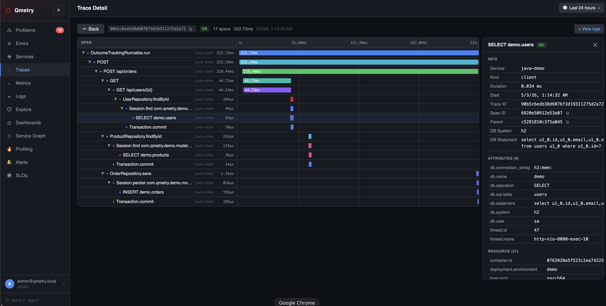
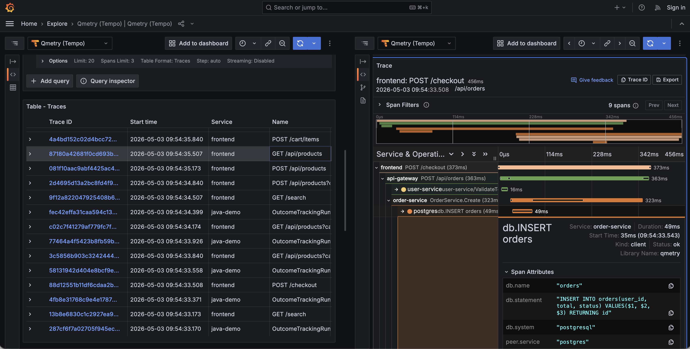
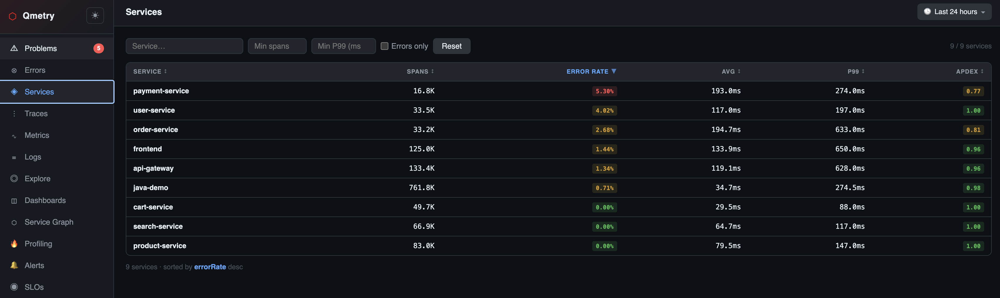
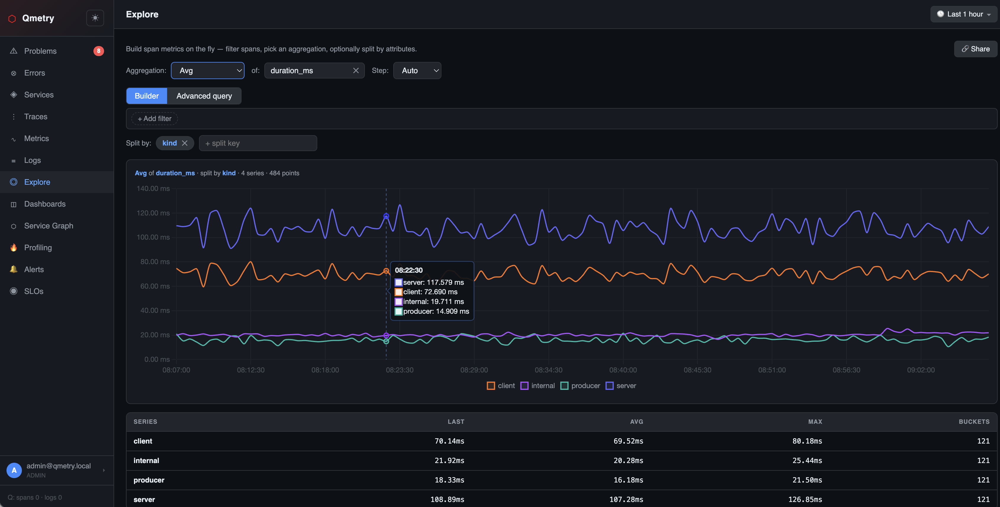
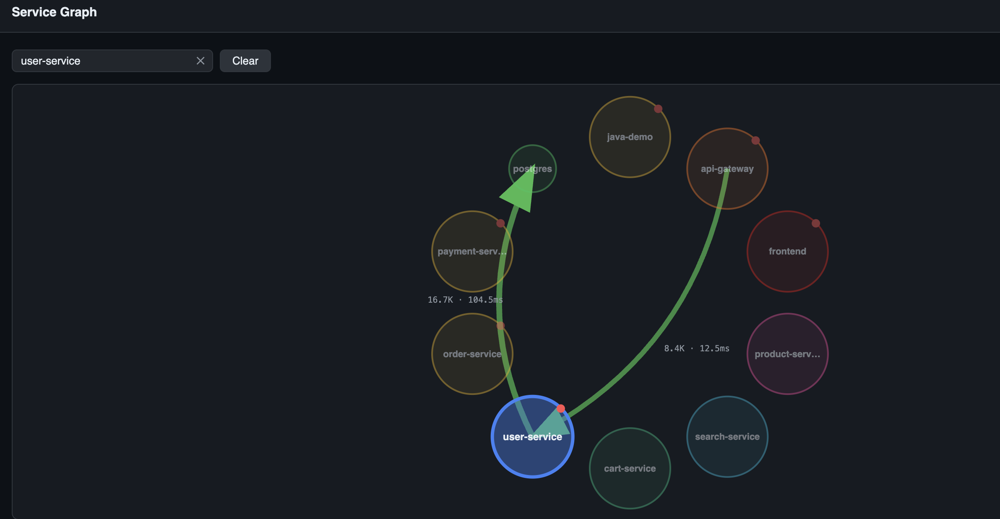
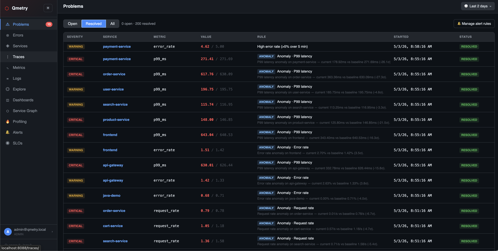
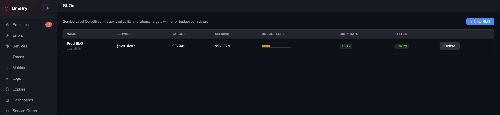
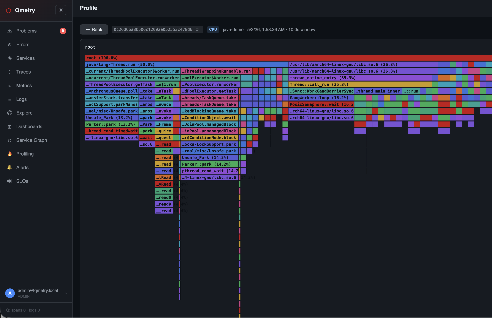
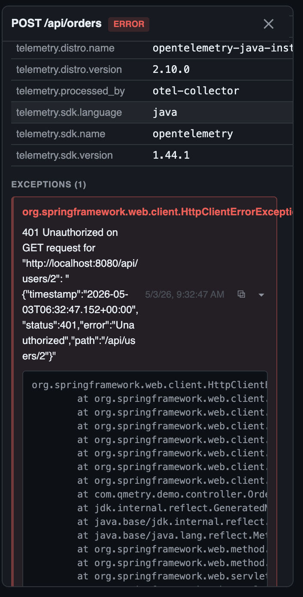
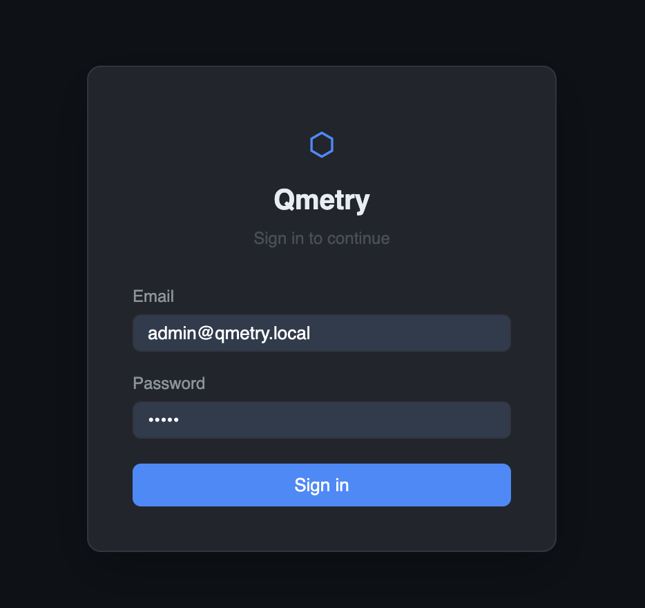

# Qmetry

Enterprise OpenTelemetry APM. Traces, metrics, logs, and profiles on
ClickHouse, with a Next.js UI, custom dashboards, SLOs, anomaly detection,
local + OIDC auth, and a Tempo-compatible API for Grafana integration.

```
apps ──▶ OTel Collector ──▶ Qmetry (gRPC :4317)
                              │
                              ├── ClickHouse  (storage)
                              ├── Redis       (cache + leader lock, optional)
                              └── HTTP UI/API (:8088)
```

---

## Screenshots

<p align="center">
  
  <br><sub><em>Tempo-style trace waterfall — span timeline, attributes, events, and inline stacktraces.</em></sub>
</p>

<p align="center">
  
  <br><sub><em>Qmetry exposed as a native Tempo datasource — query traces from Grafana Explore, with node graph and trace-to-logs jumps.</em></sub>
</p>

<table>
  <tr>
    <td width="50%">
      <br>
      <sub><b>Services</b> — Apdex, error rate, P99 latency, sortable</sub>
    </td>
    <td width="50%">
      <br>
      <sub><b>Dashboards</b> — metric / span-aggregation / stat / markdown panels</sub>
    </td>
  </tr>
  <tr>
    <td width="50%">
      <br>
      <sub><b>Service Graph</b> — auto-discovered topology with call rates and error stains</sub>
    </td>
    <td width="50%">
      <br>
      <sub><b>Problems</b> — rule-based + Watchdog-style anomaly detection</sub>
    </td>
  </tr>
  <tr>
    <td width="50%">
      <br>
      <sub><b>SLOs</b> — availability / latency SLIs with error-budget burn down</sub>
    </td>
    <td width="50%">
      <br>
      <sub><b>Profiling</b> — async-profiler / pprof flame graphs, trace-to-profile drill-down</sub>
    </td>
  </tr>
  <tr>
    <td width="50%">
      <br>
      <sub><b>Span detail</b> — exception events with full stack frames, log correlation</sub>
    </td>
    <td width="50%">
      <br>
      <sub><b>Login</b> — local username/password + optional OIDC SSO button</sub>
    </td>
  </tr>
</table>

---

## Quick start (Docker Compose, recommended for local + small prod)

Requires Docker + Docker Compose plugin.

```bash
git clone https://github.com/cilcenk/qmetry.git
cd qmetry
docker compose up -d
```

What you get:

| Service       | URL                       | Notes                                       |
| ------------- | ------------------------- | ------------------------------------------- |
| **Qmetry UI** | http://localhost:8088     | Login: `admin@qmetry.local` / `admin`       |
| OTel Collector| `localhost:14317` (gRPC)  | Apps send here; collector forwards to qmetry|
|               | `localhost:14318` (HTTP)  |                                             |
| ClickHouse    | `localhost:9000`          | Native protocol; HTTP on `:8123`            |
| Grafana       | http://localhost:3000     | Pre-wired Qmetry → Tempo datasource (admin/admin) |
| Java demo     | (in network)              | Auto-instrumented Spring Boot, sends traces |

Optional profiles:

```bash
docker compose --profile grafana   up -d   # add Grafana
docker compose --profile go-demo   up -d   # add a Go traffic generator
```

Point your own apps at the collector:

```bash
export OTEL_EXPORTER_OTLP_ENDPOINT=http://localhost:14318   # HTTP
# or
export OTEL_EXPORTER_OTLP_ENDPOINT=http://localhost:14317   # gRPC
```

---

## Production install (Helm)

The chart lives in [`charts/qmetry`](charts/qmetry). It deploys Qmetry plus
an optional in-cluster Redis and OTel Collector. **ClickHouse is external** —
use the [Altinity Operator](https://github.com/Altinity/clickhouse-operator)
or ClickHouse Cloud.

```bash
helm install qmetry ./charts/qmetry \
  --namespace qmetry --create-namespace \
  --set clickhouse.addr=ch-cluster.databases.svc:9000 \
  --set secrets.clickHousePassword=$CH_PASSWORD \
  --set secrets.jwtSecret=$(openssl rand -hex 32) \
  --set secrets.initialAdminPassword=$INITIAL_PW \
  --set ingress.enabled=true \
  --set ingress.hosts[0].host=qmetry.example.com \
  --set ingress.hosts[0].paths[0].path=/ \
  --set ingress.hosts[0].paths[0].pathType=Prefix
```

After install, the chart's NOTES print port-forward / ingress URLs and warn
if you left any insecure defaults in place.

### Common overrides

```yaml
# my-values.yaml
replicaCount: 3                 # safe — Redis lock arbitrates background workers

clickhouse:
  addr: ch.databases.svc:9000
  database: qmetry
  username: qmetry

# Use an existing Secret instead of letting the chart create one:
secrets:
  existingSecret: qmetry-prod-secrets
  # Must contain keys: jwt-secret, clickhouse-password,
  #                    initial-admin-password, oidc-client-secret

ingress:
  enabled: true
  className: nginx
  annotations:
    cert-manager.io/cluster-issuer: letsencrypt-prod
  hosts:
    - host: qmetry.example.com
      paths: [{ path: /, pathType: Prefix }]
  tls:
    - secretName: qmetry-tls
      hosts: [qmetry.example.com]

autoscaling:
  enabled: true
  minReplicas: 3
  maxReplicas: 10

# OIDC SSO (Google, Keycloak, Okta, Auth0…)
config:
  auth:
    oidc:
      enabled: true
      issuerUrl:   https://accounts.google.com
      clientId:    "<your-client-id>"
      redirectUrl: https://qmetry.example.com/api/auth/oidc/callback
      defaultRole: viewer
      allowedDomains: ["acme.com"]
secrets:
  oidcClientSecret: "<your-client-secret>"

# External managed Redis (ElastiCache, Memorystore, Upstash...)
redis:
  enabled: false
  external:
    url: "rediss://:password@my-redis:6380/0"
```

```bash
helm upgrade --install qmetry ./charts/qmetry -f my-values.yaml -n qmetry
```

### Helm chart values reference

| Key                          | Default                        | Notes |
| ---------------------------- | ------------------------------ | ----- |
| `image.repository`           | `ghcr.io/cenk/qmetry`          | |
| `image.tag`                  | `Chart.appVersion`             | |
| `replicaCount`               | `1`                            | Scale up freely; lock arbitrates workers |
| `service.httpPort`           | `8088`                         | Web UI + REST API + OTLP/HTTP fallback |
| `service.grpcPort`           | `4317`                         | OTLP/gRPC ingest |
| `ingress.enabled`            | `false`                        | |
| `autoscaling.enabled`        | `false`                        | HPA on CPU + memory |
| `clickhouse.addr`            | `clickhouse:9000`              | **Required** — external CH |
| `clickhouse.database`        | `qmetry`                       | Created on first boot |
| `redis.enabled`              | `true`                         | In-cluster Redis (small/dev) |
| `redis.external.url`         | `""`                           | If set, in-cluster Redis is skipped |
| `otelCollector.enabled`      | `true`                         | Sidecar collector deployment |
| `config.retention.spansDays` | `30`                           | TTL on the spans table |
| `config.auth.oidc.enabled`   | `false`                        | Local auth always remains available |
| `secrets.jwtSecret`          | `""`                           | **Set in prod** — empty rotates on restart |
| `secrets.initialAdminPassword` | `"admin"`                    | **Change before exposing** |

Full surface in [`charts/qmetry/values.yaml`](charts/qmetry/values.yaml).

---

## Build from source

```bash
make            # builds frontend (Next.js static export) + Go binary
./qmetry        # uses ./config.yaml
```

Requirements: Go 1.25+, Node 20+, a reachable ClickHouse.

Configure via [`config.yaml`](config.yaml) or environment variables:

| Env var                       | Effect                                     |
| ----------------------------- | ------------------------------------------ |
| `QMETRY_CH_ADDR`              | ClickHouse host:port                       |
| `QMETRY_CH_PASSWORD`          | ClickHouse password                        |
| `QMETRY_HTTP_ADDR`            | UI/API listen address (default `:8088`)    |
| `QMETRY_GRPC_ADDR`            | OTLP/gRPC listen (default `:4317`)         |
| `QMETRY_REDIS_URL`            | `redis://host:port/db` — enables cache + lock |
| `QMETRY_JWT_SECRET`           | HS256 signing key (set this in prod)       |
| `QMETRY_INITIAL_ADMIN`        | Bootstrap admin email                       |
| `QMETRY_INITIAL_PASSWORD`     | Bootstrap admin password                    |
| `QMETRY_OIDC_ENABLED`         | `true` to enable OIDC SSO                  |
| `QMETRY_OIDC_ISSUER_URL`      | OIDC discovery URL                         |
| `QMETRY_OIDC_CLIENT_ID`       | OIDC client ID                             |
| `QMETRY_OIDC_CLIENT_SECRET`   | OIDC client secret                         |
| `QMETRY_OIDC_REDIRECT_URL`    | Public callback URL                        |

---

## Scaling notes

| Load              | Architecture                                             |
| ----------------- | -------------------------------------------------------- |
| < 50 svc, < 5k spans/s | Single Qmetry replica. ClickHouse on SSD. No Redis required. |
| 50–500 svc, 5–50k spans/s | Multiple Qmetry replicas behind a service. **Enable Redis** (cache + leader lock). External managed CH. |
| 500+ svc, very high ingest | Same as above + Kafka/Redpanda between OTLP receiver and CH writers (durability + replay). CH cluster with sharding (Altinity Operator). |

Why Redis matters once you horizontally scale Qmetry:

- **Distributed lock** — the alert evaluator, anomaly detector, and SLO
  computation must run *once per tick*, not once per replica. Without
  Redis, every replica opens the same Problems.
- **Hot cache** — sidebar polls `/api/problems` every 30s per logged-in
  user. At 100 active users that's 3 RPS just for the badge. The 5s TTL
  cache collapses this to ~0.2 RPS against ClickHouse.
- **Service list, metric names, OIDC discovery** — read-mostly, expensive
  to compute, ideal cache candidates.

---

## Authentication

- **Local** username/password is always available, even when OIDC is on
  (so you keep an admin fallback if the IdP is unreachable).
- **OIDC SSO** is opt-in via `auth.oidc.enabled`. Standard Authorization
  Code + PKCE + nonce. First-time OIDC users are auto-provisioned with
  `auth.oidc.defaultRole`. Optional `allowedDomains` whitelist.
- Sessions are stateless JWTs in `HttpOnly` cookies. Set
  `QMETRY_JWT_SECRET` in production so sessions survive restarts.
- The first run seeds an admin from `auth.initial_admin` /
  `initial_password`. Rotate the password from the user menu after first
  login. Subsequent runs are no-ops if any users exist.

---

## Layout

```
.
├── main.go                  # entrypoint
├── internal/
│   ├── api/                 # HTTP API + Tempo-compatible routes
│   ├── auth/                # JWT + bcrypt + OIDC + middleware
│   ├── cache/               # Redis cache + distributed lock (Noop fallback)
│   ├── chstore/             # ClickHouse repository layer
│   ├── consumer/            # Batch ingest pipeline (in-memory queue → CH)
│   ├── otlp/                # OTLP gRPC + HTTP ingest
│   ├── evaluator/           # Alert rule evaluator (background)
│   ├── anomaly/             # Watchdog-style baseline anomaly detector
│   └── profileconv/         # pprof / async-profiler ingest + flame graph
├── frontend/                # Next.js static export (embedded into binary)
├── charts/qmetry/           # Helm chart
├── docker-compose.yml       # Local dev stack (CH + collector + Java demo + Grafana)
└── config.yaml              # Default config
```
