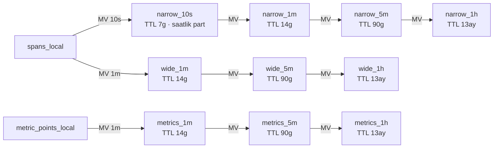

# ClickHouse Rollup / Pre-aggregation Katmanı — Aşama 1 Tasarım

**Tarih:** 2026-07-30 · **Kapsam:** şema doğrulama + DDL (`migrations/0001–0004`). Ingest path'ine ve API'ye dokunulmadı.

---

## 1. Şema doğrulama raporu (repo'dan, dosya:satır)

| Soru | Bulgu | Referans |
|---|---|---|
| Span tablosu adı | Tek düğümde `spans` (bare MergeTree). Coremetry-yönetimli cluster'da `adaptDDL` DDL'i `spans_local` (Replicated + `{shard}/{replica}` macro) + `spans` Distributed wrapper'a çevirir. **Dış distributed prod'da** `spans_local`'ı operatör yönetir ve Coremetry `cluster_name`'i çoğu zaman BOŞ görür (v0.8.185/186 olayları) — `ON CLUSTER uptrace_all` uygulamadan önce `system.clusters`'ta doğrulanmalı | `internal/chstore/store.go:567`, `cluster_test.go:22-82` |
| Kolonlar | `trace_id/span_id/parent_id String`; `name/kind/service_name/status_code/http_route/...` LowCardinality; `time DateTime64(9)`; `duration Int64 CODEC(T64,ZSTD(3))`; `attr_keys Array(LC(String))` + `attr_values Array(String)`; `op_group`; `cluster` MATERIALIZED | `store.go:567-603` |
| `duration` birimi | **NANOSANİYE** — tüm okumalar `/1e6 → ms` | `spanmetric.go:376-382` |
| CHANNEL_CODE / FUNCTION_CODE | **Ayrı kolon DEĞİL** — `attr_keys/attr_values` dizisinde. Opsiyonel promotion katmanı hazır: `traceAttrMaterialized` (boş gelir; per-install `ALTER ... MATERIALIZED` + boot probe doldurur) | `repo.go:2385-2411`, `docs/audit/traces-attribute-columns.md` |
| endpoint alanı | `http_route` (LC, `''` default) HTTP girişleri; RPC/messaging girişlerinde span adı `name`. Mevcut Endpoints yüzeyi ikisini `entryWhere` ile ayırır; rollup tek kolona katlar: `if(http_route != '', http_route, name)` | `store.go:583`, `endpoints.go:485-489` |
| TTL / partition | `spans`: `PARTITION BY toDate(time)`, `ORDER BY (service_name, time)`, `TTL toDate(time)+INTERVAL sd DAY` (sd default **30**). Mevcut spanmetrics: 1m→30 gün, 10s→2 gün | `store.go:600-602,557`, `store.go:2387+` |
| ClickHouse sürümü | Compose pin **24.8-alpine**; proje şartı "ClickHouse 24+". `sumForEachState/MergeState`, `quantilesTDigestMergeState`, `SimpleAggregateFunction(sum)` 24.8'de mevcut ve stabil. tDigest birleşimi sıra-bağımlı ≤%2 hata bandı (mevcut kabul) | `docker-compose.yml:3` |
| **Çakışma notu** | Repo'da ZATEN bir spanmetrics ailesi var: `spanmetrics_1s/10s/1m` (dims: service, **name**, kind, status, http_route; tdigest + exemplar state'leri; kaskadsız, her biri doğrudan spans'ten). Yeni DAR aile bunun daha ucuz/uzun-TTL'li üstü; GENİŞ aile channel/function boyutunu getirir. Geçiş planı §7'de | `store.go:2387-2420,3003` |

---

## 2. Rollup aileleri ve kaskad



**A) DAR** (`rollup_spans_narrow_*`): dims `(service_name, span_kind, status_code)`; latency `quantilesTDigestState(0.5,0.95,0.99)(duration)`, kaskadda `quantilesTDigestMergeState`. Sayaçlar `SimpleAggregateFunction(sum, UInt64)`.

**B) GENİŞ** (`rollup_spans_wide_*`): dims A + `endpoint, channel_code, function_code`; latency **20 elemanlı eksponansiyel bucket** (`bucket i = [1ms·2^i, 1ms·2^(i+1))`, i=0..19 → son bucket ≥ ~8.7 dk taşmaları toplar), `AggregateFunction(sumForEach, Array(UInt64))` ≈ 160B/satır (tDigest ~1-1.5KB'a karşı).

**Ortak:** exemplar `argMaxState(trace_id, duration)` + `anyIfState(trace_id, status='error')`, kaskadda `-MergeState`. `ReplicatedAggregatingMergeTree` + `ON CLUSTER uptrace_all`; MV'ler `_local`'a bağlanır ve `_local`'dan okur; `ttl_only_drop_parts=1`; ts→`Delta,ZSTD(1)`, sayaçlar→`T64,ZSTD(1)`.

**`function_code` kararı:** distinct sayısı prod'da ölçülmedi → güvenli varsayılan düz `String` + `bloom_filter(0.01)` (DDL'de). Geçiş kontrolü:
```sql
SELECT uniq(attr_values[indexOf(attr_keys,'FUNCTION_CODE')])
FROM spans WHERE time > now() - INTERVAL 1 DAY;
-- < 10k ise LowCardinality(String)'e çevrilebilir (yeniden yaratım gerektirir)
```

**CHANNEL_CODE/FUNCTION_CODE okuma maliyeti:** MV `indexOf(attr_keys, …)` ile diziden okur (satır başına ~O(attr sayısı), tipik 10-30 eleman). `attr_channel_code`/`attr_function_code` MATERIALIZED kolonları promote edilirse (mevcut `traceAttrMaterialized` mekanizması) MV SELECT'indeki iki satır değiştirilip maliyet sıfırlanır — DDL'de yorumlu alternatif hazır.

---

## 3. Bucket dizisinden p50/p95/p99 — örnek sorgu

```sql
-- Log-lineer enterpolasyonlu quantile: hedef rank'in düştüğü bucket bulunur,
-- bucket içi lineer pay [2^i, 2^(i+1)) ms aralığına oturtulur.
WITH
    sumForEachMerge(lat_buckets)              AS b,          -- Array(UInt64), 20 eleman
    arrayCumSum(b)                            AS cum,
    cum[20]                                   AS total,
    [0.50, 0.95, 0.99]                        AS qs
SELECT
    service_name, endpoint,
    arrayMap(q ->
        (
            -- hedef rank
            greatest(1., q * total) AS r,
            -- rank'i kapsayan ilk bucket (1-tabanlı)
            arrayFirstIndex(c -> c >= r, cum) AS i,
            -- bucket alt sınırı (ms) + bucket içi lineer pay
            exp2(i - 1) * (1 + (r - if(i = 1, 0, cum[i-1])) / greatest(1, b[i])) AS est_ms
        ).3
    , qs) AS p50_p95_p99_ms
FROM rollup_spans_wide_1h
WHERE service_name = {svc:String}
  AND ts >= {from:DateTime} AND ts < {to:DateTime}
GROUP BY service_name, endpoint
ORDER BY p50_p95_p99_ms[3] DESC
LIMIT 50
SETTINGS max_execution_time = 10;
```
Hata payı: bucket genişliği 2× olduğundan enterpolasyonlu tahmin gerçek değerin
[alt sınır, üst sınır] bandında; pratikte p95/p99 için ±%15-30 — breakdown
SIRALAMASI için yeterli, hassas SLO ölçümü DAR ailenin tDigest'inden okunur
(iki ailenin var olma sebebi tam bu ayrım).

---

## 4. Satır / disk tahmini (varsayımlar AÇIK)

**Varsayımlar (prod profili):** 1000 servis · 1B span/gün · servis başına ort. 15 aktif endpoint · 10 aktif channel_code · 30 aktif function_code; kind ~3, status ~3 değer. Kombinasyonlar bağımsız DEĞİL — gerçek aktif seri = birlikte GÖRÜLEN kombinasyonlar; orta senaryo geniş ailede **~150k aktif seri** (kötü 500k, iyi 50k).

| Tablo | Aktif seri | Satır/gün (merge sonrası) | Satır boyutu* | Gün başı disk | TTL penceresi toplam |
|---|---|---|---|---|---|
| narrow_10s | ~9k (1000×3×3) | ≤ 9k×8640 ≈ 78M (seyreklik ~%50 → ~40M) | ~90-250B (tdigest doygunluğa göre) | ~5-10 GB | 7g → **35-70 GB** |
| narrow_1m | ~9k | ~10M | ~150-400B | ~2-4 GB | 14g → **28-56 GB** |
| narrow_5m | ~9k | ~2.2M | ~200-600B | ~0.6-1.3 GB | 90g → **55-120 GB** |
| narrow_1h | ~9k | ~190k | ~300B-1.2KB | ~0.1-0.25 GB | 13ay → **25-90 GB** |
| wide_1m | ~150k | seyrek dakika ≈ 40-80M | ~350B (160B bucket + anahtar + exemplar) | ~15-30 GB | 14g → **200-420 GB** |
| wide_5m | ~150k | ~12-25M | ~350B | ~4-9 GB | 90g → **380-800 GB** |
| wide_1h | ~150k | ~1.5-3.6M | ~350B | ~0.5-1.3 GB | 13ay → **200-500 GB** |
| metrics_1m/5m/1h | metrik×servis ~50k | ~40M/gün toplam zincir | ~120B | ~5 GB | → **~250 GB** |

\* Sıkıştırma sonrası tahmin; T64+ZSTD sayaçlarda 3-6× kazandırır, tDigest state sıkışmaz. **Toplam ek disk (orta senaryo): shard başına ≈ 0.6-1.1 TB** (2 shard × 2 replica → küme genelinde ×4 ham kopya). En hassas kalem `wide_5m` 90 günlük penceresi — kardinalite varsayımı ±3× oynarsa bu satır da ±3× oynar; canlıya alım sonrası ilk hafta `system.parts` ile doğrulanmalı.

**Ingest MV maliyeti (tahmin, rapor şartı):** bugün `spans_local` insert'i başına ~10 MV tetikleniyor (service/operation/topology/db aileleri + spanmetrics_1s/10s/1m + op_group). Eklenen: taban 2 MV (narrow_10s, wide_1m) — kaskad MV'leri küçük rollup bloklarında tetiklenir, spans yoluna maliyeti ihmal edilebilir. narrow_10s: 3 LC kolonlu GROUP BY, blok başına ≤~9k grup → ucuz (+%1-2 CPU). wide_1m: satır başına 2× `indexOf` dizi taraması + `log2` + 20'lik arrayMap → baskın kalem; tahmin **+%4-8 ingest CPU** (attr promotion uygulanırsa +%2-4'e düşer). Bellek: insert bloğu başına geniş GROUP BY hash tablosu ~O(aktif kombinasyon/blok) ≈ birkaç MB. Async insert (10MB/1s coalesce, v0.5.346 — DOKUNULMADI) blok boyutunu zaten büyük tuttuğu için MV amortismanı iyi.

---

## 5. Rollup seçim mantığı — Go arayüz tasarımı (kod değil)

**Yerleşim kısıtı:** `internal/api/api.go` büyütülmez — yeni okuma uçları `internal/api/rollup_routes.go` içinde `registerRollupRoutes(mux *http.ServeMux, s *Server)` deseniyle; seçici `internal/chstore/rollupselect.go`.

**Arayüz (tasarım):**

```
RollupSelector
  Pick(q RollupQuery) RollupPlan

RollupQuery
  From, To        time.Time
  MaxDataPoints   int        // panel genişliğinden; 0 → 1500 varsayılanı
  Dims            []string   // istenen breakdown boyutları
  NeedExactQuant  bool       // SLO-hassas percentile ister mi

RollupPlan
  Table        string        // rollup_spans_narrow_1m | rollup_spans_wide_5m | ...
  StepSeconds  int64         // toStartOfInterval aralığı — RESPONSE'TA DA DÖNER
  QuantileMode string        // "tdigest" | "buckets"
  Reason       string        // gözlemlenebilirlik: neden bu tablo seçildi
```

**Karar sırası:**
1. `ideal_step = ceil((To-From) / MaxDataPoints)`
2. **Aile:** `Dims ⊆ {service,kind,status}` VE `NeedExactQuant` → DAR; `endpoint/channel_code/function_code` içeren her sorgu → GENİŞ (quantile'lar bucket'tan).
3. **Kademe:** taban ≤ `ideal_step` olan EN BÜYÜK kademe; alt sınır ailenin tabanı (DAR 10s, GENİŞ 1m), üst sınır retention kapsaması (`From` kademenin TTL penceresi içinde olmalı).
4. `StepSeconds = max(ideal_step, kademe tabanı)` kademe tabanının tam katına yukarı yuvarlanır; yanıt zarfı `{stepSeconds, series}` (mevcut `MetricResolveResult.stepSeconds` emsali, `types.ts:1892`).

**Karar tablosu** (MaxDataPoints=1500 örneğiyle):

| Pencere | ideal_step | DAR kademe | GENİŞ kademe |
|---|---|---|---|
| ≤ 4h | ≤ 10s | **10s** | 1m |
| 4h–25h | 10-60s | 10s/**1m** | 1m |
| 25h–5g | 1-5m | **1m** (retention 14g) | **1m** |
| 5g–2hf | 5-14m | **5m** | **5m** |
| 2hf–90g | 14m-1.4h | **5m**→**1h** | **5m**→**1h** |
| > 90g | > 1.4h | **1h** (13 ay) | **1h** |

Not: bu sözleşme, grafik-deneyimi auditinin (docs/audit/chart-experience-audit-2026-07-30.md) Faz B "maxDataPoints + step zarfı" işiyle AYNI kontrat — iki iş tek uygulamada birleşir.

---

## 6. Backfill stratejisi (şablonlar: `migrations/0004_backfill.sql`)

1. DDL'ler uygulanır → MV'ler canlı akışı ANINDA yazmaya başlar (t₀).
2. Tabanlar geçmişten doldurulur: narrow_10s **saatlik**, wide_1m ve metrics_1m **günlük** parçalarla `INSERT...SELECT` (`spans_local`'dan, shard başına ayrı; ON CLUSTER değil). Parça sınırı partition sınırına hizalı; yarım kalan parça önce `DROP PARTITION` sonra tekrar (AggregatingMergeTree mükerrer state'i toplar — idempotent değildir).
3. `to` sınırı t₀'ın bir tam bucket ÖNCESİ — canlı MV ile çift sayım penceresi kapatılır.
4. Kaskadlar alt kademeden doldurulur (10s→1m→5m→1h), taban bitmeden başlamaz.
5. Kapsam dürüstlüğü: spans retention default 30 gün — 90g/13ay kademeleri backfill'le DEĞİL, zamanla dolar; ilk 90 günde 5m/1h pencereleri kısmi kalır ve seçici `Reason` alanında bunu söyler.

---

## 7. Mevcut spanmetrics ailesiyle ilişki (geçiş notu)

`spanmetrics_1s/10s/1m` bugün /endpoints ve resolver hızlı-yollarını besliyor; DOKUNULMADI. Orta vadede DAR aile spanmetrics_10s/1s'in "overview" yükünü devralabilir (daha az boyut + kaskad + 13 aya kadar tarih); `name` boyutlu sorgular spanmetrics_1m'de veya GENİŞ ailenin `endpoint` kolonunda yaşar. Emeklilik kararı Aşama 2+ konusu — bu aşamada iki aile YAN YANA yaşar (ingest maliyeti §4'te bu varsayımla hesaplandı).

---

## 8. Aşama 2'ye bırakılanlar (onay bekler)

- `RollupSelector` + `registerRollupRoutes()` implementasyonu ve mevcut okuma yollarının kademeli geçişi
- Attr promotion migration'ı (`attr_channel_code`/`attr_function_code`) — wide MV maliyetini düşürür; distributed-column-safety disipliniyle (hasXCol probe)
- spanmetrics ailesiyle konsolidasyon kararı
- Grafik-audit Faz B ile ortak `{series, stepSeconds}` yanıt zarfı
